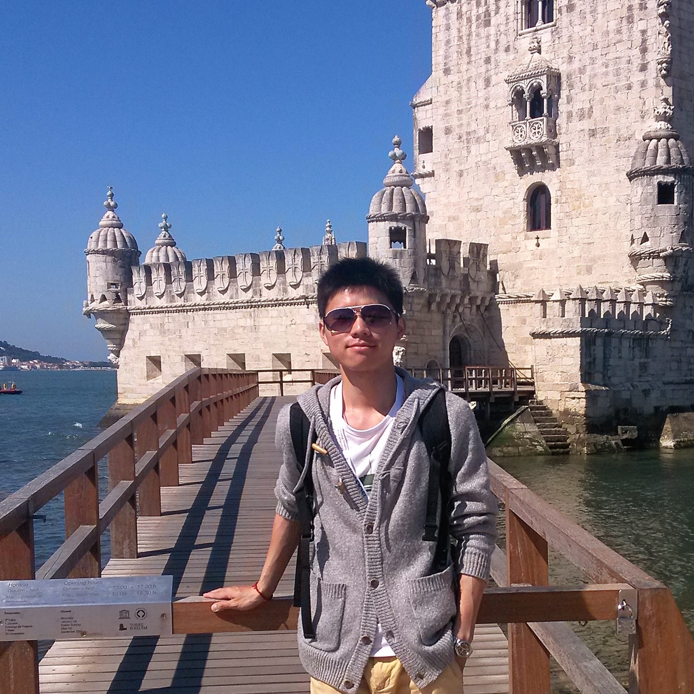

# About Me
My name is Fengbin Tu. I'm currently pursuing the Ph.D. degree with the Institute of Microelectronics, Tsinghua University, Beijing, China. My dissertation's title is **High Energy-efficient Neural Network Accelerator Design**, advised by Prof. Shaojun Wei and Prof. Shouyi Yin. 

A reconfigurable multi-modal neural network processor (Thinker) has been designed based on my [DNA](http://ieeexplore.ieee.org/document/7898402/) architecture. The Thinker chip was exhibited at the [2016 National Mass Innovation and Entrepreneurship Week](http://news.tsinghua.edu.cn/publish/thunews/9648/2016/20161013102253491194453/20161013102253491194453_.html), as a representative work from Tsinghua University. The Thinker chip was highly praised by Chinese Premier Li Keqiang, and featured by [Yang Lan One on One](http://www.iqiyi.com/v_19rr77vmeo.html?wx_uid1=wxidoG0a9jsItpryB9soI-lGgUuUtvlc&wx_uid2=wxidoG0a9jsItpryB9soI-lGgUuUtvlc) and [AI Tech Talk](https://www.leiphone.com/news/201705/8sB0WHz6D70J7NAy.html). It won the [ISLPED'17 Design Contest Award](http://islped.org/2017/index.php), which was [the first time for a Chinese Mainland team to win the award](http://news.tsinghua.edu.cn/publish/thunews/10303/2017/20170809193415062503521/20170809193415062503521_.html).

This is an exciting field where fresh ideas come out every day, so I'm maintaining a project named [Neural Networks on Silicon](https://github.com/fengbintu/Neural-Networks-on-Silicon), to collect works that interest me and make comments on them.

# Research Interests
Computer Architecture, Deep Learning, VLSI Design, Approximate Computing, Reconfigurable Computing

# Education
Sep. 2013 - Present: **Tsinghua University (THU)**

* GPA 3.8/4.0, Rank 2/20 in the Institute of Microelectronics
* Ph.D. Candidate of Electronic Science and Technology

Sep. 2009 - Jun. 2013: **Beijing University of Posts and Telecommunications (BUPT)**

* GPA 3.9/4.0, Rank 1/255 in the School of Electronic Engineering
* Bachelor of Electronic Science and Technology 

# Project Experience
Feb. 2017 - Present: **DNA II**

* I'm designing the 2nd generation of DNA (DNA II) to enable ultra low-power computing of deep neural networks. Optimization techniques from the hardware level to the software level are used.

Jan. 2016 - Present: [**Neural Networks on Silicon**](https://github.com/fengbintu/Neural-Networks-on-Silicon)

* I'm collecting works on neural network accelerators and related topics, in a GitHub project named [Neural Networks on Silicon](https://github.com/fengbintu/Neural-Networks-on-Silicon). It has attracted many researchers all around the world.

Sep. 2015 - Oct. 2016: **DNA**

* I have designed a deep convolutional neural network accelerator (DNA) targeting flexible and efficient CNN acceleration. 
  - This is the first work to assign Input/Output/Weight Reuse to different layers of a CNN, which optimizes system-level energy consumption based on different CONV parameters.
  - A 4-level CONV engine is designed to to support different tiling parameters for higher resource utilization and performance.
  - A layer-based scheduling framework is proposed to optimize both system-level energy efficiency and performance.
* A reconfigurable multi-modal neural network processor (Thinker) has been designed based on the DNA architecture.

Mar. 2015 - Dec. 2016: **Image/Video Encoder Based on RNA**

* I have designed an image/video encoding system based on my previous design RNA. The system can online switch to an image encoder or video encoder, by reconfiguring the processing core RNA.

Oct. 2013 - Oct. 2014: **RNA**

* I have designed a reconfigurable neural accelerator (RNA) that can be configured for different neural networks. RNA is targeted for approximate computing in multiple application domains.

# Selected Publications
Journal Papers
* **F. Tu**, S. Yin, P. Ouyang, S. Tang, L. Liu, S. Wei, "[Deep Convolutional Neural Network Architecture with Reconfigurable Computation Patterns](http://ieeexplore.ieee.org/document/7898402/)," IEEE Transactions on Very Large Scale Integration Systems (TVLSI), 2017. (**Rank NO.6 in TVLSI's most frequently accessed papers for April 2017**)

Conference Papers
* S. Yin, P. Ouyang, S. Tang, **F. Tu**, L. Liu, S. Wei, "A 1.06-to-5.09 TOPS/W Reconfigurable Hybrid-Neural-Network Processor	for Deep Learning Applications," Symposia on VLSI Technology and Circuits (VLSI Symposia), Kyoto, Japan, 2017. (**The 1st Student Author**)
* **F. Tu**, S. Yin, P. Ouyang, S. Tang, L. Liu, S. Wei, "A Reconfigurable Multi-modal Neural Processor for Cognitive Intelligence Applications," Presentation at the ISSCC Student Research Preview Session (ISSCC-SRP), San Francisco, USA, 2017. (**Acceptance Rate<25%**)
* **F. Tu**, S. Yin, P. Ouyang, L. Liu, S. Wei, “RNA: A Reconfigurable Architecture for Hardware Neural Acceleration," Design, Automation and Test in Europe Conference (DATE), Grenoble, France, 2015. (**Acceptance Rate: 22%**)
* **F. Tu**, S. Yin, P. Ouyang, L. Liu, S. Wei, “Neural Approximating Architecture  Targeting Multiple Application Domains," IEEE International Symposium on Circuits and Systems (ISCAS), Lisbon, Portugal, 2015.

# Invited Talks
DNA: Deep Convolutional Neural Network Architecture with Reconfigurable Computation Patterns
* Conference talk at ISSCC, San Francisco, USA, Feb. 2017.
* Conference talk at ISLPED, Taipei, Jul. 2017.
* THU Ph.D. Student Forum, Beijing, China, Oct. 2016.
* Deephi Tech, Beijing, China, Apr. 2017.
* AI Tech Talk, [Online](https://www.leiphone.com/news/201705/8sB0WHz6D70J7NAy.html), May 2017.
* Tsinghua-ROHM International Forum of Industry-Academia (TRIFIA), Beijing, China, May 2017.
* Huawei, Beijing, China, Jun. 2017.
* Future Chip Forum, Beijing, China, Jun. 2017.
* Momenta, Beijing, China, Aug. 2017.

# Honors and Awards
* ISLPED'17 Design Contest Winner (2017)
* Outstanding Postgraduate Assistant of THU (2016)
* ICFC Fellowship for Outstanding Ph.D. Students (2016)
* THU Outstanding Student Scholarship (2016)
* Lam Research Scholarship (2015)
* Outstanding Paper Award at THU Ph.D. Student Forum (2015)
* Outstanding Graduate of BUPT (2013)
* National Scholarship for Undergraduate Students (2010, 2011, 2012)
* Merit Student of BUPT (2010, 2011, 2012) 

# Contact
Address: Room 3-330, FIT Building, Tsinghua University, Beijing, 100084, P.R. China

Email1: tufengbin at gmail dot com

Email2: tfb13 at mails dot tsinghua dot edu dot cn

At Cabo da Roca, May, 2015.

"Aqui, onde a terra se acaba e o mar começa..." — Luís de Camões, *Os Lusíadas*
